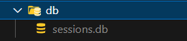

# 🤖 mv-bot

Automates administrative tasks in Miagao Valley.

## Core features

-   Automation of tasks
    -   Automatic creation of GitHub organization invite link.
    -   Creation of new Projects (including setting up the GitHub repository and Discord channels).
-   Web interface for functions

## 💻 Technology stack

-   Express.js
-   EJS
-   octokit (GitHub API Client)

## 🔌 Installation

1. Clone the repository:

```
 git clone https://github.com/Miagao-Valley/mv-bot.git
```

2. Install dependencies:

```
 npm install
```

3. Create **db** folder with **sessions.db** file inside:
   

## 🧞 Usage

All commands are run from the root of the project, from a terminal:

| Command              | Action                                             |
| :------------------- | :------------------------------------------------- |
| `npm install`        | Installs dependencies                              |
| `npm run start:dev`  | Starts local dev server at `localhost:4141`        |
| `npm run start:prod` | Starts production ready server at `localhost:4141` |
| `npm run build`      | Pre-Hook that gets called before deployment        |

## 💪🏼 Contributing

**Using the issue tracker**

Use the issue tracker to suggest feature requests, report bugs, and ask questions. This is also a great way to connect with the developers of the project as well as others who are interested in this solution.

Use the issue tracker to find ways to contribute. Find a bug or a feature, mention in the issue that you will take on that effort, then follow the *Changing the code-base* guidance below.

**Changing the codebase**

1. Clone the repository.
2. Create a new branch: `git checkout -b branch-name`.
3. Make your changes.
4. Push your branch: `git push origin branch-name`.
5. Create a pull request.

## 🤲 Getting involved

This project belongs to the open-source community named Miagao Valley 🇵🇭. We have interesting projects you might want to check out 👀. Visit our community [here](https://discord.gg/BzhUm6k4z7)!


